<p align="center">
  
</p>

<p align="center">
  
  
  
  
  
</p>

<p align="center">
  <em>Release sky lanterns into the night and watch them drift among the stars.</em><br/>
  <sub>Inspired by the iconic lantern scene from Disney's <i>Tangled</i> — now for Minecraft Java Edition.</sub>
</p>

<br/>

---

## ✨ Overview

**Tangled Lantern** adds craftable sky lanterns to Minecraft Java Edition. Hold one in your hand, right-click, and watch it slowly float upward — drifting left and right with a gentle sine-wave motion, rotating softly on its axis, and flickering with small flame particles as it climbs into the night sky.

> No equivalent mod existed for Java Edition. **Now there is one.**

There is an equivalent for **Bedrock Edition** ([Tangled Lantern on CurseForge](https://www.curseforge.com/minecraft-bedrock/addons/tangled-lantern)), but Java players had nothing. This mod fills that gap.

---

## 🌟 Features

| Feature | Details |
|---------|---------|
| 🏮 **Sky Lanterns** | Floating entities that slowly rise and drift with a gentle sine-wave sway |
| 🔥 **Particle Flames** | Small flame particles flicker from the base every 3 ticks |
| 💫 **Always Glowing** | Renders at full brightness — visible even in complete darkness, no shaders needed |
| 🌀 **Soft Rotation** | Slowly spins on its Y-axis as it floats upward |
| 🎇 **No Collision** | Passes freely through blocks and other entities (`noClip = true`) |
| ⏳ **Auto-Despawn** | Fades away after 5 minutes (6 000 ticks) — no chunk lag |
| 🎮 **Survival Ready** | Craftable, stackable to 16, works in Creative mode (item not consumed) |
| 🌍 **Localized** | English (`en_us`) and Spanish (`es_es`) included |

---

## 🔮 Crafting Recipe

<p align="center">

| &nbsp; | ① | ② | ③ |
|:------:|:---:|:---:|:---:|
| **A** | &nbsp; | 🧵 String | &nbsp; |
| **B** | 📄 Paper | 🔦 Torch | 📄 Paper |
| **C** | &nbsp; | 📄 Paper | &nbsp; |

</p>

<p align="center"><b>Yields: 4 × Sky Lanterns</b></p>

The recipe is intentionally cheap — sky lanterns are meant to be released in quantity for events, festivals, and atmospheric builds.

---

## 📦 Installation

> **Requires:** Minecraft 1.21.1 + Fabric Loader + Fabric API

1. Install [**Fabric Loader**](https://fabricmc.net/use/) for Minecraft **1.21.1**
2. Download [**Fabric API 0.116.x+1.21.1**](https://modrinth.com/mod/fabric-api) and place it in `mods/`
3. Download `tangled-lantern-1.0.0.jar` from the [**Releases**](../../releases) tab
4. Drop the `.jar` into `.minecraft/mods/`
5. Launch — the **Sky Lantern** appears in the **Tools** creative tab

---

## 🎮 Usage

| Action | Result |
|--------|--------|
| **Right-click** with Sky Lantern | Spawns a lantern just in front of you |
| **Creative mode** | Item is **not** consumed |
| **Survival mode** | Consumes **1** lantern per release |
| **Wait 5 minutes** | Lantern auto-despawns with no residue |
| **Multiple players** | Each can release their own — no entity limit |

**Tips:**
- Release several at once for a festival effect — each floats at its own rhythm
- Works best at night or in dark builds; the full-bright rendering makes them glow beautifully
- Try releasing them from a tall tower and watching them drift apart

---

## 🛠️ Building from Source

**Requirements:** Java 21, Git, internet connection

```bash
git clone https://github.com/JackStar6677-1/tangled-lantern
cd tangled-lantern

# Generate textures (optional — already included)
pip install Pillow
python3 generate_textures.py

# Build
./gradlew build
```

Output: `build/libs/tangled-lantern-1.0.0.jar`

> The first build downloads Minecraft game files and Fabric dependencies (~200 MB). Subsequent builds are fast.

---

## 🔧 Technical Details

<details>
<summary>Entity behaviour</summary>

`FloatingLanternEntity` extends `Entity` (not `LivingEntity`) with:
- `noClip = true` — passes through all blocks
- `setNoGravity(true)` — gravity disabled, movement fully manual
- Upward velocity: **0.035 blocks/tick** (~0.7 blocks/second)
- Horizontal drift: `sin(age × 0.04) × 0.007` on X, `cos(age × 0.03) × 0.007` on Z
- Lifetime: **6 000 ticks** (5 minutes at 20 TPS)
- Not attackable, not collidable

</details>

<details>
<summary>Rendering</summary>

`FloatingLanternEntityRenderer` renders with:
- `RenderLayer.getEntityCutoutNoCull` — no face culling for proper depth
- `LightmapTextureManager.MAX_LIGHT_COORDINATE` — renders at full brightness regardless of world light
- Y and Z scale negated (`scale(s, -s, -s)`) — standard Minecraft model flip
- Slow Y-axis rotation: **0.6°/tick**
- Model: single cuboid box (10×16×10 px), 64×64 texture

</details>

<details>
<summary>Mod ID and registry keys</summary>

| Key | Value |
|-----|-------|
| Mod ID | `tangledlantern` |
| Entity type | `tangledlantern:floating_lantern` |
| Item | `tangledlantern:sky_lantern` |
| Recipe | `data/tangledlantern/recipe/sky_lantern.json` |

</details>

---

## 📁 Project Structure

```
src/main/
├── java/com/tangledlantern/
│   ├── TangledLantern.java              ← main entrypoint
│   ├── entity/
│   │   └── FloatingLanternEntity.java   ← movement, lifetime, particles
│   ├── item/
│   │   └── SkyLanternItem.java          ← right-click to release
│   ├── registry/
│   │   ├── ModEntities.java
│   │   └── ModItems.java
│   └── client/
│       ├── TangledLanternClient.java    ← client entrypoint
│       ├── ModModelLayers.java
│       └── entity/
│           ├── FloatingLanternEntityModel.java    ← box model, bob animation
│           └── FloatingLanternEntityRenderer.java ← full-bright, rotation
└── resources/
    ├── fabric.mod.json
    ├── assets/tangledlantern/
    │   ├── lang/        en_us.json, es_es.json
    │   ├── textures/    entity/floating_lantern.png, item/sky_lantern.png
    │   └── models/item/ sky_lantern.json
    └── data/tangledlantern/
        └── recipe/      sky_lantern.json
```

---

## 🗺️ Roadmap

- [ ] Custom lantern colours (red, blue, green variants)
- [ ] Wind direction config — lanterns drift with the "wind"
- [ ] Lantern bundle item (releases 5 at once)
- [ ] LambDynamicLights integration for real dynamic light emission
- [ ] Sound effect on release (paper rustling + ignition)

---

## 📜 License

**MIT** — free to use, modify, fork, and redistribute with attribution.

---

<p align="center">
  <sub>Made with ✦ for Minecraft Java Edition</sub>
</p>
